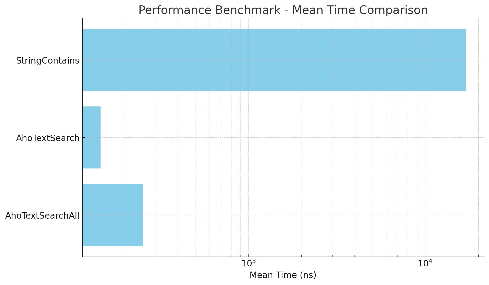

# Aho Search String [[English](./README.md)]

## 설명

이 프로젝트는 문자열 내에서 문자열 패턴 집합의 모든 항목을 찾는 데 사용되는 강력하고 효율적인 문자열 검색 알고리즘인 Aho-Corasick 알고리즘을 C#으로 구현한 것입니다.
이 알고리즘은 스팸 필터, 침입 탐지 시스템 같이 여러 패턴을 동시에 일치시켜야 하는 애플리케이션에 특히 유용합니다.

Aho-Corasick 알고리즘은 Alfred V. Aho와 Margaret J. Corasick이 1975년에 발명한 검색 알고리즘입니다.
이는 사전과 유사한 유한 상태 기계를 구성하여 텍스트 내에서 효율적인 다중 패턴 일치를 허용합니다.


## 설치

```bash
dotnet add package AhoStringSearch
```

## API

입력된 `input` 문자열에 문자열 패턴과 일치하는지 검사

```csharp
var input = "He gave her a cookie, but his dog ate it before she could say thanks.";

var search = new AhoStringSearch();

// Build Trie
var trie = search.CreateTrie();
trie.AddString("him");
trie.AddString("it");
trie.AddString("his");
trie.Build();

var actual = search.Search(input);
Assert.Equal("his", actual);
```

## 성능

4,783개 문자열 단어 규칙 중 4,783번째 `zombie` 문자열을 찾는 경우 ([negative-words.txt](src/AhoStringSearch.Benchmark/negative-words.txt))

| Method           | Mean        | Error     | StdDev    |
|----------------- |------------:|----------:|----------:|
| AhoTextSearchAll |    253.4 ns |   3.37 ns |   3.15 ns |
| AhoTextSearch    |    145.8 ns |   1.03 ns |   0.96 ns |
| StringContains   | 16,971.0 ns | 114.98 ns | 101.92 ns |



## 직렬화/역직렬화 (실험적 기능)

Aho-Corasick 알고리즘의 Trie를 구축하는 시간은 상당히 길기 때문에 Trie를 직렬화하여 파일에 저장하고 필요할 때 다시 로드할 수 있습니다.

```csharp
// trie 노드를 파일에 저장
var search = new AhoStringSearch();
var trie = search.CreateTrie();
trie.AddString("his");
trie.Build();

using var fs = new FileStream("test.trie", FileMode.Create);
using var bw = new BinaryWriter(fs);
var context = new TrieSerializationContext();
context.Write(trie, bw);

// trie 노드를 파일에서 로드
using var fs = new FileStream("test.trie", FileMode.Open);
using var br = new BinaryReader(fs);
var context = new TrieSerializationContext();
var root = context.Load(br);

var search = AhoStringSearch.CreateFrom(root);
```